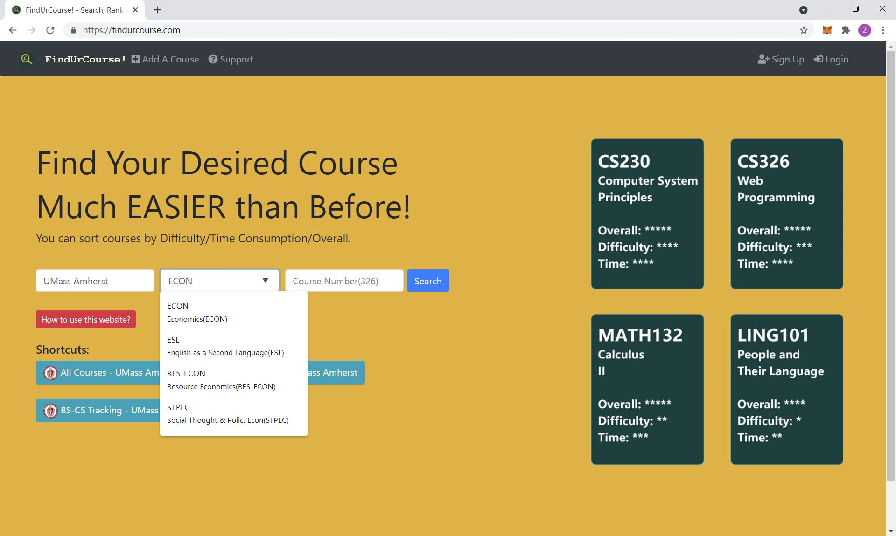
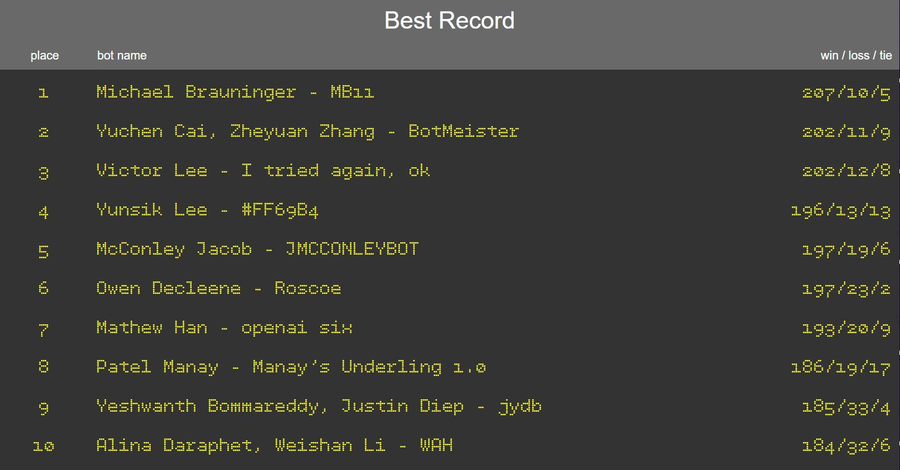
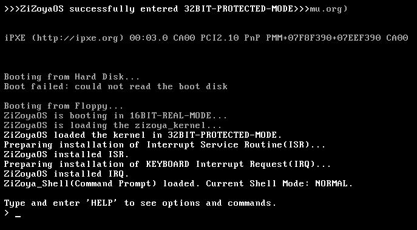
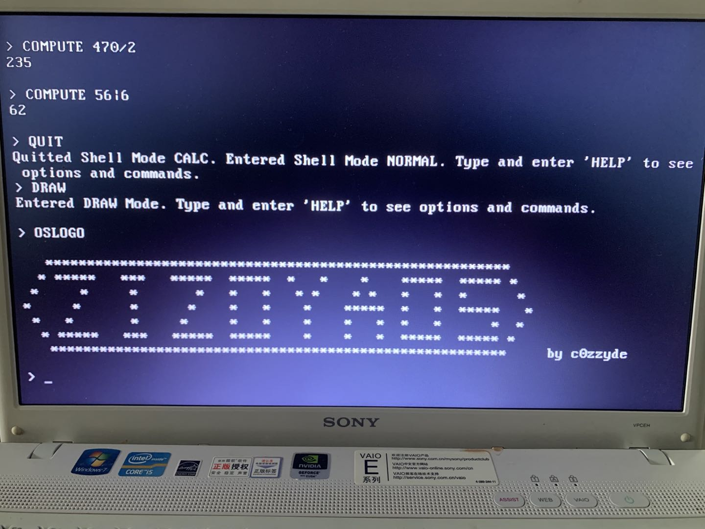
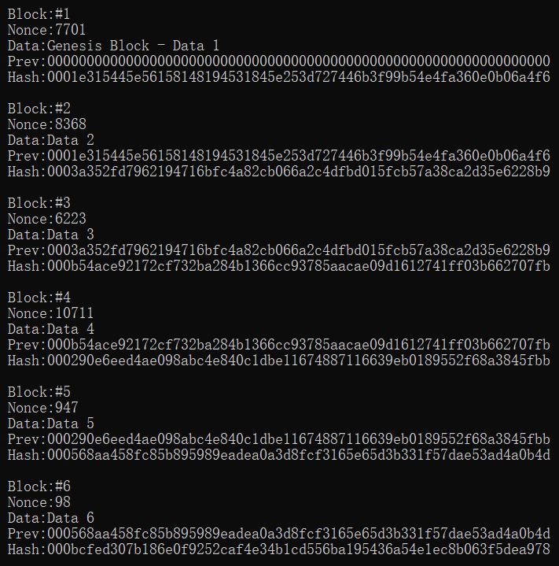
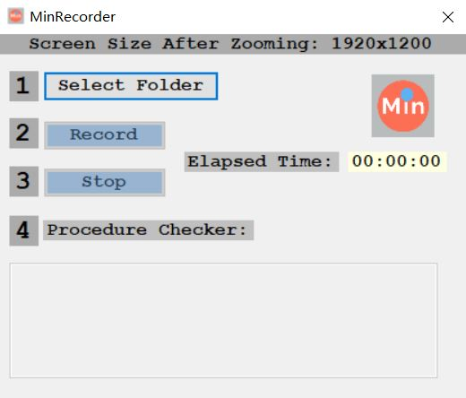
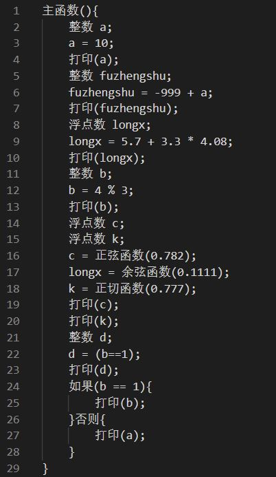
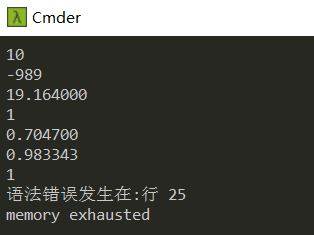



I am an undergraduate student at [UMass Amherst](https://www.umass.edu/).  

:computer:Computer Science(B.S.), GPA: 3.84/4.0  
:hourglass_flowing_sand:September 2018 - May 2022  

**Research Interests:**

Robotics and Artificial Intelligence.

**My Hobbies:**

:computer:Coding  
:muscle:Fitness/Bodybuilding  
:video_game:Video Games  
:headphones:Hi-Fi(I am an audiophile)

# Publications
 | some descriptions

# Honors and Awards
- 6 x Dean's List Honors | University Registrar - UMass Amherst
- 2nd Place - W/L/T: 202/11/9 | Adversarial Search Minimax AI Robot Competition Best Record Leader Board
- Certificate | 2021 ROS Summer School

# Experience
## Fudan University Robotics Lab Researcher(Full-time) - June 2021 - August 2021
### Robotic Grasping and Machine Vision
- Robotic Grasping: ROS, Rviz, handeye calibration, object localization w/ YOLOv4, motion planning w/ MoveIt
- Machine Vision: YOLOv4, geometric shape detection, template matching, grasp pose estimation
- Hardwares: Aubo-i5 robot arm with Robotiq gripper(USB) and Chishine3D RGB-D camera; UR5 robot arm with custom gripper(Modbus) and Intel RealSense D435 RGB-D camera  
Videos(Youtube):
<iframe width="560" height="315" src="https://www.youtube-nocookie.com/embed/A2RF7lv9RPU" title="YouTube video player" frameborder="0" allow="accelerometer; autoplay; clipboard-write; encrypted-media; gyroscope; picture-in-picture" allowfullscreen></iframe>
 
<iframe width="560" height="315" src="https://www.youtube-nocookie.com/embed/xGX9G9U-w4Q" title="YouTube video player" frameborder="0" allow="accelerometer; autoplay; clipboard-write; encrypted-media; gyroscope; picture-in-picture" allowfullscreen></iframe>
 
<iframe width="560" height="315" src="https://www.youtube-nocookie.com/embed/bAulqND6-_s" title="YouTube video player" frameborder="0" allow="accelerometer; autoplay; clipboard-write; encrypted-media; gyroscope; picture-in-picture" allowfullscreen></iframe>

### SLAM
Explored open-source Cartographer SLAM simulation

# Robotics Projects
## Projects from CS403 Robotics
- 

# Other Projects
## Course Projects(300+ Level)
### 1. FindUrCourse – Node.js Web Application (Final Project of CS326 Web Programming)
Website: :link:[www.findurcourse.com](https://www.findurcourse.com/)  
Github: :link:[github.com/cozheyuanzhangde/Findurcourse](https://github.com/cozheyuanzhangde/Findurcourse)  
About: FindUrCourse is a website designed for students to search, rank and rate college courses.
:mag: HTML/CSS, Bootstrap, JavaScript, Node.js, Express, PostgreSQL
- Separated front-end and back-end.
- Front-end user interface w/ Bootstrap and back-end server w/ Node.js.
- PostgreSQL database for managing data of users and courses including course comments.
- Server APIs executes SQL commands on Node.js by pg-promise. (25 API end-points in total for front-end functionalities.)
- Login/logout session using Express + Passport and users passwords are encrypted using non-reversible hash encryption before entering database, so users' password security is protected.

Index(home) page image:

### 2. Projects from CS370 Introduction to Computer Vision
- Project 1: Matrix manipulation, Image formation, Light, White balance
- Project 2: Aligning Prokudin-Gorskii images(Cosine similarity), Color image demosaicing(Bayer filter, Nearest neighbor, Linear interpolation)
- Project 3: Improving image constrast(contrast stretching, gamma correction, histogram equalization), Image denoising(Gaussian filtering, Medium filtering), Hybrid images
- Project 4: Image Gradient and Orientation Histogram, Corner Detection(Simple corner detector, Harris Corner detector)
- Project 5: Panoramic Image Stitching(Detect corners, Feature extraction, Computing matches, Estimating transformation using RANSAC)
- Project 6: Decision trees, K-nearest neighbor classifier, Linear classifier
- Some of the course contents are not presented in the projects.

### 3. Projects from CS383 Artificial Intelligence
- Project 1: Solving a Weighted 8-puzzle(Searches: Breadth-first,
Uniform-cost, Greedy best-first, and A*; Heuristic functions: "number of misplaced tiles", "Manhattan distance" and modified "Manhattan distance")
- Project 2: Adversarial Search(Minimax, Alpha-Beta Pruning, Evaluation Heuristic). There's a Minimax Game "Robot" heuristic function design competition and my team(2-man team) got a #2 among 223 game bots. Record(win/loss/tie):202/11/9  
Best Record Leader Board:  

- Project 3: Constraint Satisfaction Problems, Logic/Logical Inference
- Project 4: Bayesian network probability estimation(Simple sampler, Rejection sampler, Likelihood weighting sampler)
- Project 5: Value iteration for the MDP(Markov Decision Processes)
- Project 6: Decision tree classification(Learn a decision tree from a data set which contains facts about the 350 cities and towns in Massachusetts, with a class label indicating the local results of the 2020 U.S. presidential election)
- Some of the course contents are not presented in the projects.

### 4. Projects from CS576 Game Programming
- 

### 5. Projects from CS589 Machine Learning
- 

## Personal Projects
### 1. ZiZoyaOS - 32-Bit Operating System (In Development)
:mag: NASM Assembly，C，Shell Script，Linux
- Bootloader: print characters/strings in 16-bit real mode using BIOS Interrupt, read disk sectors, clear screen, switch the operating system into 32-bit protected mode, load the kernel and initialize the GDT.
- Kernel: ports communication, display driver, initializing IDT, ISR and IRQ, capturing CPU interrupts(processing and feedback), keyboard driver(key combinations enabled).
- Simple shell: user-interface.
- Functionalities: Calculator mode (basic operations including bit operations), clear interrupts, clear screen, simple drawing (print a simple pattern by default), halt CPU, test clock signals, etc.

ZiZoyaOS runs on QEMU virtual machine/(qemu-system-i386)emulator:

ZiZoyaOS runs on a REAL PC(Old SONY VAIO):

### 2. Quanin - Automatic Stock Screener
:mag: Python, Baostock, Pandas, TA-Lib, Matplotlib, C#.NET, Winform
- Due to confidentiality, detailed implementation is not posted.

### 3. Blockchain
:mag: C++, Cryptography library
- Hash function: SHA-256
- Proof of Work(PoW)
- Mining with alterable hash difficulty.

Block 1-6 after mining:

### 4. Windows Applications
#### Screen Capturer
:mag: C#.NET, Windows, Winform, FFmpeg, NAudio

Image:

#### Phishing Simulator - For Cybersecurity Educational Use (Made in high school)
:mag: VB.NET, SMTP
- A QQ(A well-known messager application) simulator demostrates how malicious software induce users entering account/password and how they transmit those data to hackers using SMTP server.

### 5. Interpreter/Compiler (Halted Development)
:mag: C, Flex, Bison, (LLVM)
- Aim to create a chinese version C-like programming language
- Flex generates lexer which takes an input and output with tokens
- Bison generates parser which takes tokens and output with Abstract Syntax Tree(AST)
- :triangular_flag_on_post:C-like grammar :triangular_flag_on_post:Print function :triangular_flag_on_post:Multi-length variable :triangular_flag_on_post:Define variable data type :triangular_flag_on_post:Accurate error report(syntax, lexical, custom error with line number) :triangular_flag_on_post:Data types: integer, float(positive/negative numbers) :triangular_flag_on_post: Operators: add, minus, multiply, divide, power, mod, equality :triangular_flag_on_post:Math functions: sin(), cos(), tan()
- :bug: IF-ELSE
- Example code and output:

Code:

Output:

## Computer Science Courses at UMass Amherst
1. Introduction to Problem Solving with Computers
2. Programming with Data Structures
3. Programming Methodology
4. Computer Systems Principles
5. Reasoning Under Uncertainty
6. Introduction to Computation
7. Introduction to Algorithms
8. Web Programming
9. Introduction to Computer Vision
10. Artificial Intelligence
11. Introduction to Robotics: Perception, Mechanics, Dynamics, and Control(2021 Fall)
12. Game Programming (2021 Fall)
13. Machine Learning (2021 Fall)
